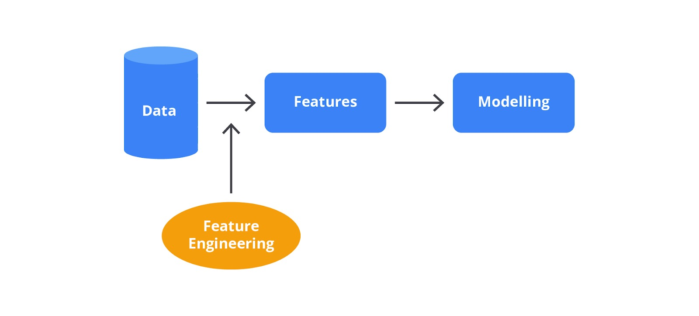
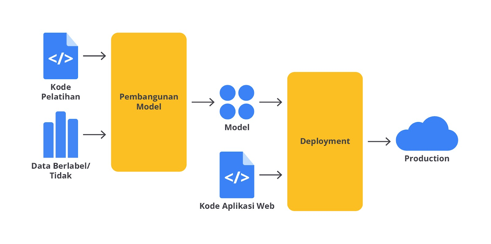
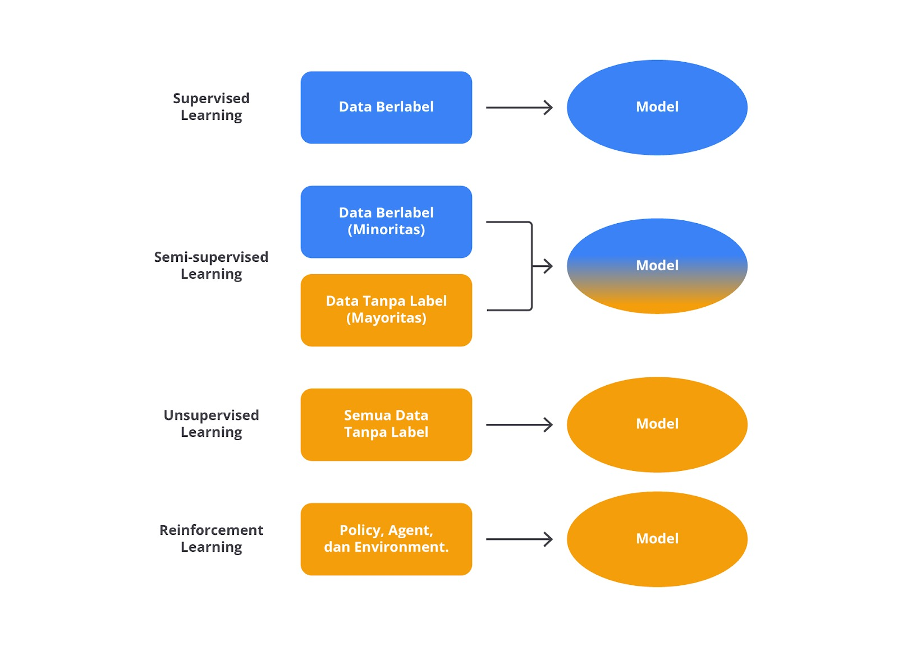

# PENGANTAR MACHINE LEARNING 

Machine learning dipopulerkan oleh arthur samuel 1959.  

ML adalah cabang ilmu yang memberikan komputer untuk belajar dan berkembang tanpa perlu diprogram secara eksplisit untuk setiap task

### taksonomi AI:
1. **Artificial Intelligence**  
Ai mencakup penggunaan komputer atau mesin untuk melakukan task yang membutuhkan kecerdasan manusia:
    - pengambilan keputusan
    - pengenalan pola
    - pemecahan masalah

2. **Machine Learning**  
ML adalah cabang dari AI yang digunakan untuk:
    - pattern recognition in data
    - prediction
    - decision making berdasarkan informasi

3. **Neural Network**  
NN adalah model matematis yang terinspirasi dari struktur jaringan saraf manusia yang digunakan untuk:
    - memproses informasi
    - belajar dari data
    - mampu mempeljari representasi yang semakin abstrak dari data

4. **Deep Learning**  
DL adalah sub-bidang dari ML yang menggunakan NN dengan banyak lapisan (DNN) untuk memahami representasi data yang abstrak dan kompleks

5. **Gen Ai**  
Gen AI adalah cabang AI yang berfokus pada penciptaan konten yang menghasilkan teks, gambar, musik, video, dan lain lain.

## KOMPONEN UTAMA DALAM MACHINE LEARNING

1. **Data**
   Data adalah bahan dasar untuk machine learning yang terdiri dari fitur dan label
   
2. **Model**
Model adalah algoritma matematis yang diguanakan untuk mempelajari pola dari data
3. **Algoritma**
   Algoritma adalah metode yang digunakan untuk melatih model dengan data
4. **Feature Engineering**
   Feature engineering adalah proses megnubah data mentah menjadi fitur yang lebih relevan dan informatif untuk model. bagian ini melibatkan pemilihan, transformasi, dan pembuatan fitur baru dari data yang ada.
   
5. **Training**
   Training adalah proses model belajar dari data.
6. **Evaluation**
   Evaluation adalah proses menilai kinerja model menggunakan data yang tidak digunakan selama pelatihan
7. **Hyperparameter Tuning**
   hyperparameter tuning adalah proses mengoptimalkan parameter diluar model yang memengaruhi kinerja model
8. **Deployment**
   Deployment adalah tahap akhir ketika model yang telah dilatih diterapkan dalam lingkungan nyata untuk digunaka pada aplikasi atau sistem
   

## JENIS-JENIS MACHINE LEARNING

1. **Supervised learning**
   Supervised learning menggunakan data yang berlabel
2. **Unsupervised learning**
   Unsupervised learning menggunakan data yang tidak berlabel
3. **Semi-supervised learning**
   semi-Supervised learning menggunakan data yang berlabel dan tidak berlabel
4. **Reinforcement learning**
   Reinforcement learning fokus pada cara agen belajar mengambil tindakan untuk memaksimalkan hadiah

## MACHINE LEARNING USE-CASE

1. **Sistem Rekomendasi**
2. **Penyaringan spam email**
3. **Assistant Suara**
4. **Pengenalan gambar atau face detection**
5. **fraud detection**
6. **Chatbot layanan pelanggan**
7. **Diagnostik kesehatan**

## MERUMUSKAN MASALAH DALAM MACHINE LEARNING

1. **Identifikasi tujuan Bisnis**
  Gunakan metode SMART
2. **Pahami Data yang Tersedia**
   - Intentarisasi Data: indentifikasi semua sumber data internal dan eksternal
   - Evaluasi kualitas data: periksa kelengkapan, konsistensi, keakuratan, dan relevansi data
   - Eksplorasi data: Gunakan visualisasi serta analisis statistik untuk memahami pola dan hubungan antar variable
   - Pemilihan fitur: pilih fitur yang relevan untuk model
   - pembersihan dan transformasi data: atasi masalah seperti missing values, duplikasi, dan transformasi data untuk mempersiapkannya.

3. **Tentukan jenis masalah machine learning**
   - klasifikasi
   - regresi
   - clustering
4. **Definisikan variable target dan fitur**
   - Fitur: variable yang digunakan untuk mendeskripsikan data
   - target: variable yang ingin diprediksi atau diklasifikasikan
  
5. **Membuat Pernyataan masalah yang jelas**
   - Rumuskan masalah dengan pernyataan yang spesifik untuk mengarahkan pengembangan model (misalnya, "Memprediksi apakah pelanggan akan churn dalam 3 bulan ke depan").

## TANTANGAN DALAM MACHINE LEARNING
1. kualitas data
2. keterbatasan data
3. pemilihan model dan algoritma
4. etika dan privasi
5. pemeliharaan dan pembaruan