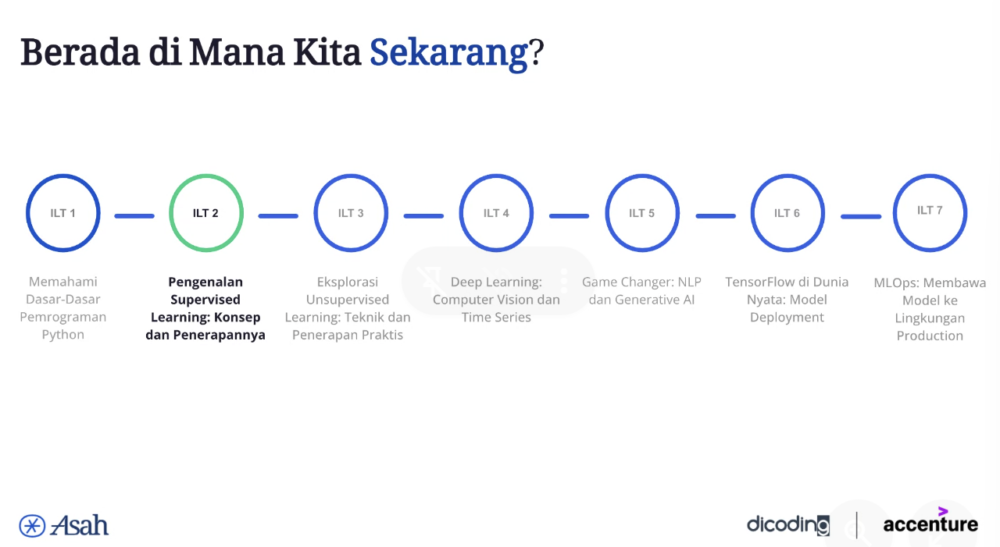
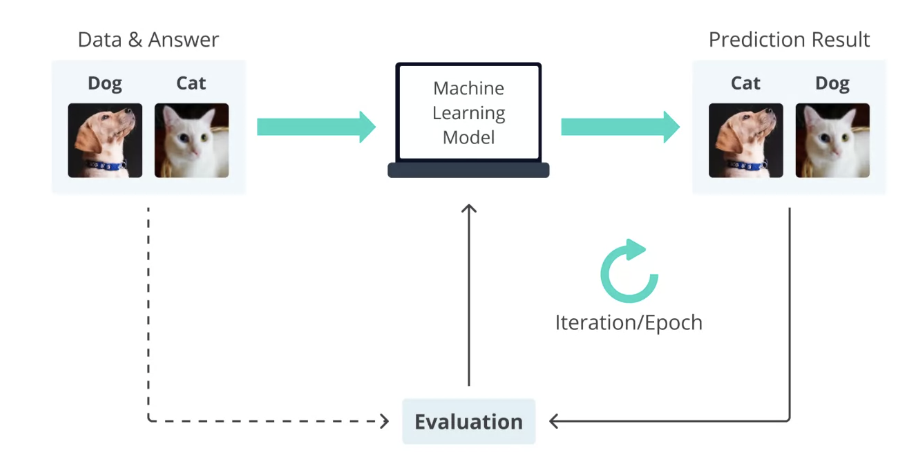
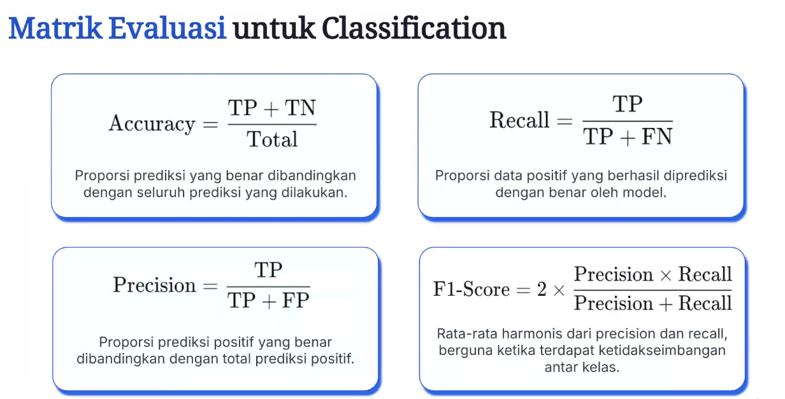

# ILT ML2 PENGENALAN SUPERVISED LEARNING

PENGISI SUARA: I NYOMAN YOGA S.  

## mari berkenalan dengan machine learning

### apa itu machine learning?

### mengapa kita membutuhkan machine learning?

### jenis jenis machine learning

#### supervised learning

apa itu supervised learning?

jenis jenis supervised learning

1. regresi: memrediksi nilai numerik dari banyak kemungkinan angka
2. klasifikasi: memprediksi kemungkinan suatu data termasuk ke dalam suatu kategori. dalam klasifikasi ada 2 kategori:
    - binary classification
    - multi-class classification

bagaimana cara kerja supervised learning?

prediksi vs aktual:
cost function atau loss function.  

cara mengukur error dengan matrix evaluasi untuk regression:
MAE dan MSE

